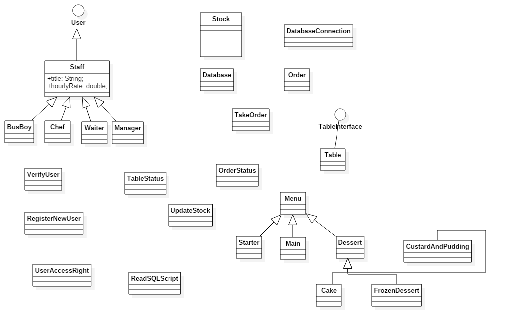

# Restaurant
Restaurant management system

### Problem domain:
A fast-growing medium sized restaurant is experiencing major problems as they are still operated using pen and paper methods, with little or no automation. The main issue is record maintenance. Since the restaurant was initially small everything is done by paper, the management is responsible for keeping all information saved and organized, which is no easy task. Everyday tabs are collected, data needs to be organized and employees need to get paid. This requires a great deal of time and attention from the managers. The second problem is the management of the kitchen stockTest as the management needs to be constantly aware of the stockTest that is available.

### Proposed solution:
The most feasible solution is to computerize restaurant operation so that all information pertaining to customer’s orders and staff activity will be conveniently shared and stored over the restaurant’s database. The software that will be created is going to be tailored specifically for this restaurant to meet its needs and demands and most importantly cater for the business growth and management.

**User requirements (Functional requirements):**
1.	Take orderTest
    - Enter customer orderTest
    - Place the orderTest once customer has finished with what they want
    - Mark the tableTest as “occupied” 
2.	View tableTest status
    - Table statuses (Occupied, empty and dirty, empty and clean or booked)
3.	Waiter/Waitress will be able to view incoming/completed orderTest
4.	The entire orderTest is recorded
5.	Bus boys will be able to view the real-time floor status allowing them to know which tables are clean, dirty, or occupied

### Domain Diagram:

